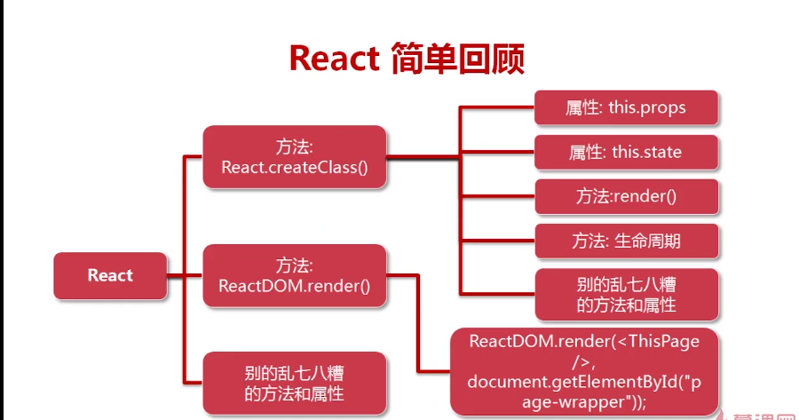

##react
**react诞生背景，解决的问题**
>基于HTML的前端界面开发正变得越来越复杂，其本质问题基本都可以归结于如何将来自于服务器端或者用户输入的动态数据高效的反映到复杂的用户界面上。而来自Facebook的React框架正是完全面向此问题的一个解决方案，按官网描述，其出发点为：用于开发数据不断变化的大型应用程序（Building large applications with data that changes over time）。相比传统型的前端开发，React开辟了一个相当另类的途径，实现了前端界面的高效率高性能开发。

###特点
**出色的性能和夸浏览器兼容性问题：**
- 独立浏览器的事件系统
- DOM系统（virtual dom）

###每个组件当中有什么？
**组件中的样式，事件，节点获取等，声明周期,属性**
- this.props.xxx            属性对象  
- this.state.xxx            状态对象
- this.props.chilren        表示父组件的所有子组件
- this.handleClick          事件处理方法
- this.ordinaryFn           普通函数
- className                 类的定义
- style={{width: width}}    元素css样式定义
- this.setState({data:data-1},()=>{})  改变组件状态
- this.refs.refName         获取dom的节点
- ReactDOM.findDOMNode(this.refs.refname)  将react节点转换为dom节点
- 组件的状态就是数据，数据变化就是状态变化；这是state
- 组件中需要配置的项设为属性，porps,可以影响state的变化

###使用ES6写法写组件

###使用React.creatClass({})写组件


###组件划分：
- 每个组件只有一个顶层标签 
- 开发之前需要设计好页面中的组件，以及组件关系
- 职责单一原则（对象，类，函数，组件）只处理一种逻辑
- 公共组件【通用型的】与业务组件【自己私有用的】
  

##总结注意事项：
1. 获取组件属性的值：this.props对象（属性是定义默认和使用组件时传入） 
2. 组件是一个状态机器 
3. 组件的声明周期 
4. 获取组件状态的值：this.state对象 
5. 组件并不是真实dom，而是存在内存当中的数据结构，叫virtual Dom 
6. this.props与this.state的区别 
  - this.props:用户一旦定义不能改变 
  - this.state:随时改变的值 
7. 组件的生命周期 
8. {}一个花括号，表示这个一段js代码，{{}}表示样式 
9. ☆react组价中的标签不能不闭合 (标签缺少一个都不行)
10. import 中导入的模块【自定义的】，必须是路径，否则not find; 
11. 组件的名称不要冲突 
12. 组件中元素的属性data - index中间有空格，会报错 
13. 组件中js执行{}不可加引号
14. browser.js编译jsx文件，不能使用本地磁盘路径file://d:
15. 事件不要绑定在组件上，组价是dom的包装器
16. jsx中js的用{}模板来计算，html的用string
17. function中的this指向
18. map遍历中，每个元素需要加上key
19. js操作中数据是核心
20. jsx中拼接字符串data-a="abc{a}"是不对的，会被当做字符串处理，data-a={'abc'+a}正确
21. jsx就是js可以嵌套循环
```
this.state.arrData.map(function (item, index) {
                            return (
                                <ul key={index} className={that.state.currentNum == index ? 'clearfix block' : 'clearfix'}>
                                    {
                                        item.map(function (a, i) {
                                            return (
                                                <li key={i}>
                                                    <a href="">
                                                        <b>{a.name}</b>
                                                    </a>
                                                </li>
                                            );
                                        })
                                    }
                                </ul>
                            );
})
```

22. 在


*****

##props
- 是子组件和父组件互动的唯一方式；

##propTypes
- 定义组件属性的数据类型

##refs
- 组件属性中可以写js函数

##mixins
- 数据的双向绑定
- 提供了一个通用的react组件的通用各种工具模块react-with-addons
- 自定义mixins
- react组价中引用这个mixin，可以写组件的生命周期
- 为了组件的复用而复用

##事件
- 事件参数（对象）
- 事件对象，属性，每个事件对象都有的
- 事件处理函数传值方式
  1. 方式1
  ```
   <li data-index={index} className={this.state.currentCity==index?"normal nav_active":'normal'} onClick={(e)=>{this.tabCity(e,index)}}  key={index}>{item}</li>
  ```

  2. 方式2
  **需要配合dom操作，不推荐**
  ```
   tabCity:function(ev){
        this.setState({
            currentCity:ev.target.getAttribute('data-index')
        });
    },
    render:function(){
      
        return (
             <ul className={this.props.isOpen?'nav_list active':'nav_list'}>
              {
                  this.props.cityListData.map((item,index)=>{
                      return (
                         <li data-index={index} className={this.state.currentCity==index?"normal nav_active":'normal'} onClick={this.tabCity}  key={index}>{item}</li>
                      );
                  })
              }       
            </ul>
        );
    }
  ```

## 整体react的总结：



