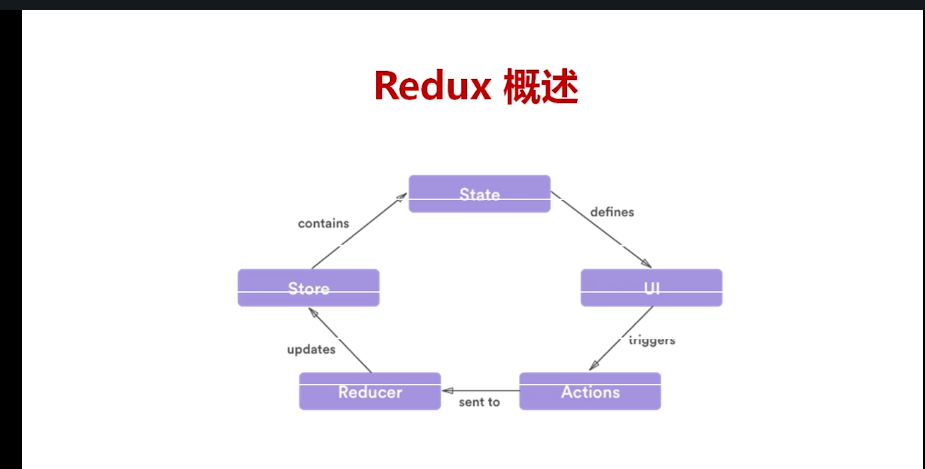
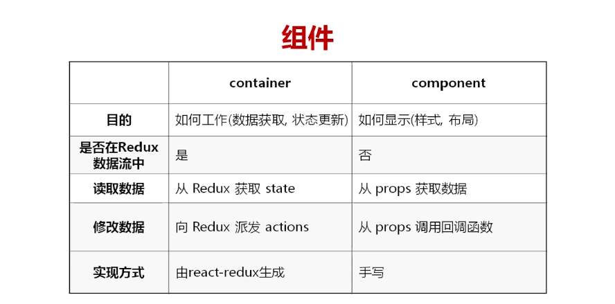

## 数据流
- 用户的每个action通过dispatch()方法分发到reducer方法中，更新若干个store中的state,返回新的store，更新到view上；

#redux
数据流：应用中行为与相应的抽象；

## react-redux
是react对redux数据流的react实现；

## redux应用的流程


## redux项目的基本目录结构
- components ：react展示组件
- containers : 容器组件
- reducers   : 纯函数方法
- store      : 应用的状态容器
- index.html
- server.js
- webpack

## 几个概念

1. store:保存数据的地方；
- 使用creatStore()方法生成store对象；
```
import {createStore} from 'redux';
const store=createStore(fn)
```
- store.dispatch(params):是view发出action的唯一方式,去改变state,params：是一个action
    1. dispatch可以知道reducer函数，做法是在创建store时候，将reducer传到createStore方法中；
- store.subscribe():设置监听函数，一旦state变化，就自动执行这个函数；
```
let unsubscribe=store.subscribe(listen); 返回解除对象
unsubscribe() 解除state监听
```


2. state:某个时点的数据集合
```
import {createStore} from 'redux'
const store=createStore(fn);
store.getState()
```

3. action:view发出的通知，表示state要改变
- 行为的抽象
- 不同js对象
- 可以由一般方法生成
```
const addTodo=(text)=>{
   return {
     type:'ADD_TODO',
     id:nextTODO++,
     text
   }
}
```
- 改变state的唯一方式就是action
```
{
    type:'ADD_TODO',
    content:'text'
}
```

4. action creator,action生成函数
- 因为view要多少种信息，就要有多少种action，所以action会很多，所以，使用函数来生成aciton
```
function(type,text){
    return {
    type:type,
    text:text}
}
```

5. reducer:接受到action后，改变state,并给出一个新的state
- 这是一种state计算的过程；
- 响应的抽象
```
const reducer=function(state,action){return new state}

const reducer=function(state,action){
    switch(action.type){
        case '';break;
        default:;
    }
}
```

6. 纯函数
- 同样的输入，得到同样的输出，reducer函数是纯函数，为的是保证同样的state得到同样的view


7. redux项目中的组件使用



## 总结
- redux的工作流程(redux flow)
1. 用户从view发出一个actin
    - store.dispatch(action);
2. store调用reducer,处理当前state，返回新的state
3. state变化之后，调用监听函数 store.subscribe(listener),重新渲染view;
4. 使用redux将所有组件的状态维护到底层组件，通过props来进行状态分发；
5. 只有一个单一的 store 和一个根级的 reduce 函数（reducer）
6. reducers是放到store中来。并createStore(reducers)返回store
7. store其实是reducer和state的混合体；
8. action不是直接作用在reducer上的，是作用到store上的，reudcer根据reducer来响应；
9. sotre唯一性
10. store包含完整的state
11. state完全可预测
